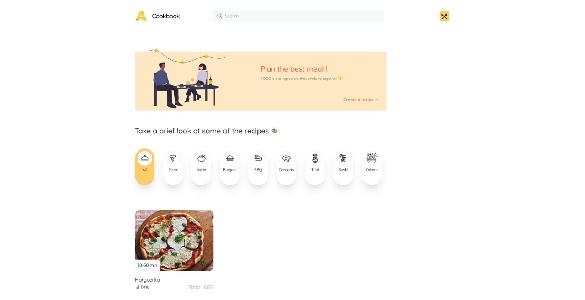

# cookbook

A small Recipe Manager application in Django (Python) in which you can create ingredients and recipes.

[CHECK THE LIVE VERSION HERE](https://cookbook-apicbase-assignment.herokuapp.com/)





## Getting Started

These instructions will get you a copy of the project up and running on your local machine for development and testing purposes.

### Installing

Make sure that you have [Docker](https://www.docker.com/get-started) installed first. Then build the image using the following command inside the cloned repository:

```
docker-compose up
```

After that, you can execute the migrations

```
docker-compose run web ./manage.py migrate
```

And you can run the seed script if you wish. It creates one recipe and some ingredients to get going.

```
docker-compose run web ./manage.py seed
```

If you want to execute other commands, you can follow the past examples

```
docker-compose run web ./manage.py your_command
```


## Built With

* [Django](https://www.djangoproject.com/) - The web framework that was used
* [Docker](https://www.docker.com) - Tool to create, deploy and run applications by using containers
* [TailwindCSS](https://tailwindcss.com/) - An awesome, highly customizable CSS framework
* [Vue.js](https://vuejs.org/) - Progressive JavaScript framework that was used in some templates
* [Chart.js](https://www.chartjs.org/) - JavaScript charting framework
